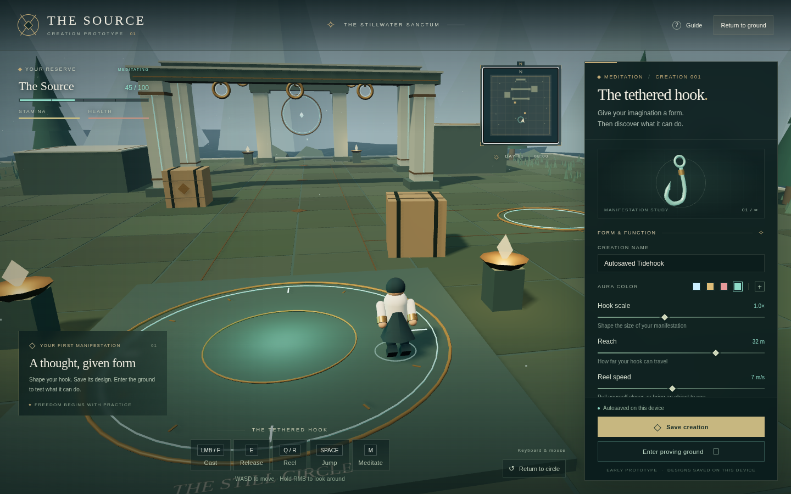
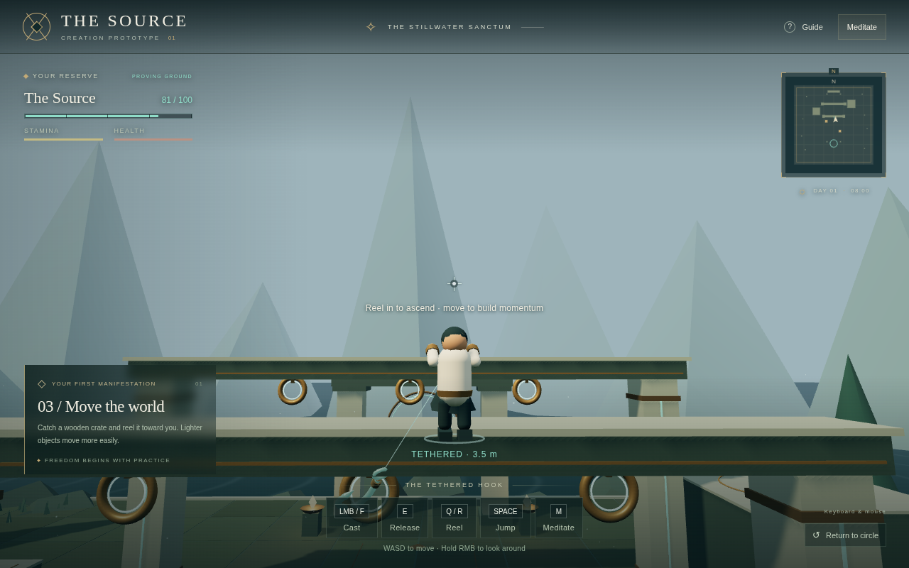

# The Source — meditation and combat prototype

Sculpt one ball of the Source into a solid design in meditation, give it an armor
or sword purpose, and test it in the proving ground. Equip a physical sword or
fists, deliberately spike your white aura, and see damage numbers on actual hits.
The existing tether workshop, rescues, slams, minimap, and saves remain available.

## Play

[Open The Source](https://splcloseone.github.io/guidance/) on a computer with a
WebGL2-capable browser, such as current Chrome or Edge. The website serves the
latest published build; source changes appear after a new publication.
See [hosting instructions](docs/PLAY-ONLINE.md) for deployment details.

For an offline copy, extract `releases/The-Source-Play.zip` and open
`The-Source.html`. Keep the same browser and file location to retain local saves.
The game does not currently have touch movement controls.

## Solid clay and combat (0.3)

In meditation choose **Open solid clay lab**. Drag the ball with Pull, Add volume,
Carve, Smooth, or Flatten. Right-drag rotates the view. Mirror symmetry and the
leg fitting outline can be disabled. Pants and sword guides are editable starting
shapes; Undo/Redo retain 24 steps while the lab is open. Precise brush sliders,
Apply brush, and rotation buttons are available for keyboard/controller users.

Choose **Wear as leg armor** or **Wield as a sword**, finish the lab, and save the
design. Enter the ground and press **N / LT + X** to manifest it. Armor reduces
melee damage by 25%; the created sword supports three strikes. Each costs 10 of
the Source to activate plus 1/sec. Meditation, exhaustion and reset dismiss them.
A sculpture purpose currently previews and saves a shape without a world action.
The solid is a bounded 28³ density field, not an unrestricted professional modeler.
Combat properties are fixed for this test; surface shape does not calculate armor
coverage, blade sharpness, or weapon reach. Creatures and riding are still future work.

Choose **Sword practice** or press **5 / LT + D-pad left**. This places you by a
rival and equips a physical sword. **LMB / RT** attacks with the selected equipment.
Press again during recovery to queue the next strike. **V / D-pad down** cycles
tether, fists, and physical sword. **F** always attempts a tether cast; selecting
Tether restores casting with RT. **C / controller B** deliberately spikes/calm your
aura; B still closes menus. Spiking costs 5 to activate + 2/sec, increases melee
damage by 50%, and reduces melee damage taken by 30%. It stacks with armor up to
55% total protection and can coexist with an active tether. It does not protect
against falls. Empty reserves weaken ordinary melee damage and movement.

The rival telegraphs a 12-damage counter before striking. Step out of range or
compare damage with protection active. Floating numbers show actual damage,
including tether slams and incoming hits. These are local practice characters;
there is no multiplayer, parrying, or guard system yet. Physical weapons consume
stamina, not the Source. Sounds start after a browser keyboard/pointer interaction.

## Make and test a tether

1. Choose **Ball** in meditation. Its editor opens automatically. Click and hold
   on the ball in the preview or editor, then drag to trace your own hook outline.
   Release to keep the shape. With keyboard/controller, **Stretch into a strand**
   produces a blank straight strand you can bend using the point controls.
2. Open the shape controls. Drag numbered points or adjust their X, Y, and depth
   values. Add/remove points, change thickness, and switch shaping assistance on
   or off. The same shape appears in the preview and in the world.
3. Alternatively, describe a supported design, such as **a long blue lasso** or
   **a thick strong hook**. This is offline vocabulary assistance for the current
   forms. Unsupported ideas receive an explanation instead of a substitute.
4. Set reach, reel speed, and strength. Thicker forms increase reinforcement and
   the reserve cost. **Save creation** adds or updates this design in your library.
5. Choose **Enter proving ground**. Aim at a brass ring and cast with F / RT. Reel
   in with Q / LT, move sideways to swing, and release with E / LB.
6. Try **Rival**, **Rescue**, and **Breakout** practice. Catch the rival, reel them
   closer, then press T / X once to lift and again to slam toward your aim. Catch
   the ally near the ledge and reel them to safety. In Breakout, repeatedly tap
   B / R3 to escape; holding the button does not build repeated escape progress.

Hooks consume the Source when activated, while sustained, and when reeling in.
Lifting and slamming also cost reserve. Meditation restores the Source. Depletion
dismisses the tether and weakens movement. The ally accepts friendly hooks by
default; the practice setting can disable them.

## Controls

Controller labels below use the standard browser Gamepad layout.

| Action | Keyboard / mouse | Standard controller |
| --- | --- | --- |
| Move | WASD / arrows | Left stick |
| Look | Hold right mouse and move | Right stick |
| Jump | Space | A / south face button |
| Sprint | Shift | Press left stick |
| Use selected equipment | Left mouse | Right trigger |
| Cast tether | F (or left mouse with Tether selected) | Right trigger with Tether selected |
| Cycle tether / fists / sword | V | D-pad down |
| Spike / calm white aura | C | B in the field |
| Manifest / dismiss solid design | N | LT + X |
| Sword practice | 5 | LT + D-pad left |
| Release | E | Left bumper |
| Reel in | Q | Left trigger |
| Pay out tether | R | Right bumper |
| Lift, then slam caught rival | T, then T again | X / west face button, twice |
| Struggle free | Repeatedly tap B | Repeatedly press right stick / R3 |
| Rival practice | 1 | D-pad left |
| Rescue practice | 2 | D-pad up |
| Breakout practice | 3 | D-pad right |
| Reset practice | 4 / Reset practice button | Restart a scenario with its shortcut |
| Meditation | M | Y / north face button |
| Close menu | Escape | B / east face button |
| Expand map | G / click minimap | View / Select |
| Controls guide | H | Menu / Start |
| Navigate workshop | Tab / mouse | D-pad or left stick |
| Activate workshop control | Enter / click | A / south face button |
| Adjust focused slider | Arrows / drag | D-pad left/right |

Practice shortcuts apply while playing; in meditation, the D-pad navigates the
workshop. Name, description, and custom color entry use browser inputs. Presets
and shape sliders allow creation editing without typing. Controller checks use
a synthetic Gamepad; specific physical controllers and consoles need testing.

## Saving

- The active design autosaves after 600 ms of inactivity. **Save creation** also
  stores it in the design library, which holds up to 20 designs. Loading a library
  design lets you revise it; starting from another preset gives it a new identity.
  A full library keeps existing designs and lets you update one of them.
- Safe position, vitals, crate transforms, and tutorial progress checkpoint every
  three seconds and when leaving or hiding the page.
- Reloading begins in meditation. Saved designs remain, but active tethers and
  practice scenarios do not resume.
- Saves belong to this browser and site or file location. They are not account
  saves. Clearing browser storage removes them, and save failures appear in the UI.
- **Return to circle** resets the physical lab and vitals while keeping the design.

## Develop

Requires Node.js 20.19+ or 22.12+ and a WebGL2 browser. This workspace uses Node 24.

```sh
npm ci --cache /tmp/source-npm-cache
npm run dev -- --port 5173
```

Vite prints its development server address. Cloud environment loopback addresses
are for internal checks; they are not a public play link. Build static assets with
`npm run build`. `npm run package:play` prepares the standalone release; check its
output before sharing it. See [continuation instructions](docs/CONTINUING.md) for
the full development, testing, and release workflow.

## Validation

```sh
npm test
npm run build
```

With the development server running, use these browser checks:

```sh
npm run test:core
npm run test:browser
```

The core suites exercise creation editing, library persistence, and character
practice. The original suites cover movement, hook physics, saving, map/guide
controls, and controller input. Run them sequentially on software WebGL machines.
`CHROMIUM_PATH` overrides `/usr/bin/chromium`; `APP_URL` selects a development
server. Reports and screenshots go in the ignored `test-results/` directory.
Actual run outcomes and remaining work are recorded in [PROGRESS.md](PROGRESS.md).

## Scope and handoff

This is a local prototype with practice characters. It has no multiplayer yet.
Tether shaping edits a bounded curve or ball; the clay lab edits a bounded solid; the description helper does not generate
arbitrary objects or creatures. A horse still needs articulation, locomotion,
mounting, and behavior systems.

Catching uses raycast attachment points and physical tether forces. Edited curves
are rendered geometry, not curved collision shapes that physically snag or wrap
around bodies. Thickness changes reinforcement; overall scale and point positions
currently affect appearance. Slams damage a rival on a qualifying collision after
a deliberate slam, not merely because the action button was pressed.

The full open world, unrestricted creation system, complete combat, networking, races,
worlds, dungeons, houses, and economy remain future work. The code separates saved
definitions, simulation, rendering, input, and workshop UI to support continued
development; those boundaries do not solve every future feature in advance.

- [ARCHITECTURE.md](docs/ARCHITECTURE.md): modules, data contracts, physics, limits.
- [CONTINUING.md](docs/CONTINUING.md): resume, verify, extend, and package changes.
- [DESIGN.md](DESIGN.md): the broader game direction agreed with the user.
- [PROGRESS.md](PROGRESS.md): current implementation and verification checkpoint.

## Earlier prototype screenshots

These images show the original meditation layout and swinging scene; newer
creation and character practice controls are not shown.




